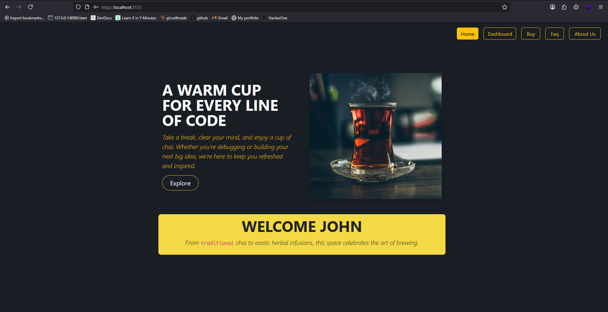
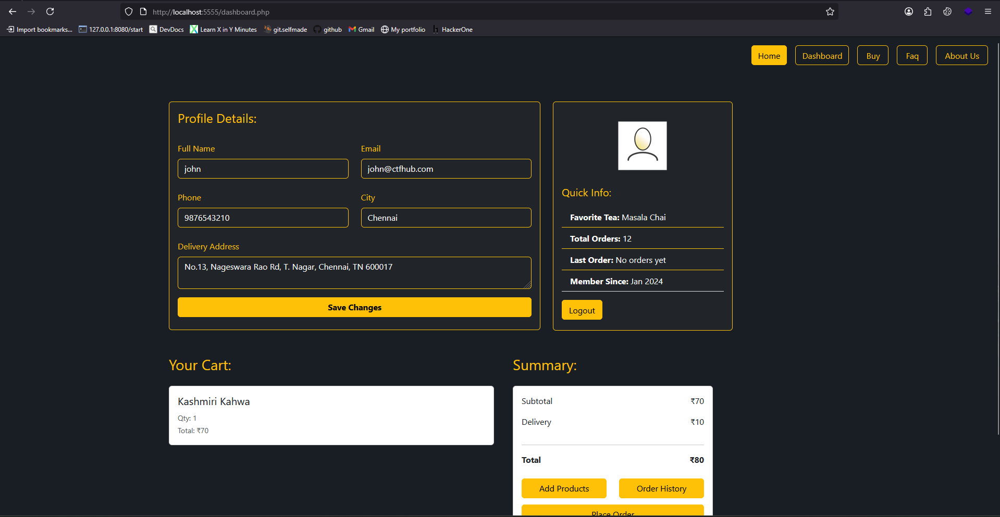

# ☕ CTF-HUB Vulnerable Tea Shop Web Application

A **multi-page vulnerable tea shop web application** built for security testing and learning purposes.  
This application contains **intentionally introduced vulnerabilities** for educational and research purposes.  
It is fully Dockerized using `docker-compose` with separate containers for **web** and **database**, and is automatically configured using modular Bash scripts.

---

## 📸 Sample Screenshots
<p align="center">
  
  
</p>

<p align="center">
  
  
</p>

---

## 📝 Description

This project simulates a real-world **e-commerce tea shop** with core features like login, signup, cart management, and order history.  
It is **purposely vulnerable** to common web security issues, making it suitable for **penetration testing**, **security training**, and **CTF challenges**.

There are **4 main vulnerabilities** in the app and each tied to a **flag** for gamified learning.

---

## ✨ Features

- **User Authentication**
  - Welcome message with username
  - Login / Logout / Signup
- **E-Commerce**
  - Add to cart
  - View cart items
  - Place orders
  - View order history
- **User Dashboard**
  - Profile update
- **Admin Panel**
  - Admin login
  - Admin dashboard
- **CTF Flags**
  - 4 flags, one per known vulnerability

---

## 🚨 Vulnerabilities Included

> **Warning** – These vulnerabilities are **intentional** and must never be deployed in a production environment.

1. **IDOR** – Insecure Direct Object Reference
2. **Admin Credentials Disclosure**
3. **Command Injection**
4. **Local File Inclusion (LFI)**
5. **SQL Injection** (Possible due to lack of input validation & sanitization )

---

## ⚙️ Setup & Installation

### **Prerequisites**
- [Docker](https://www.docker.com/)
- [Docker Compose](https://docs.docker.com/compose/)

### **Steps**
```bash
# Clone the repository
git clone https://github.com/pevinkumar10/CTF-HUB.git
cd CTF-HUB
```

# Start the containers
```bash
docker-compose up
````

# Stop the containers
```bash
docker-compose up
````

The **web app** will be available at:

```
http://localhost:5555
```

---

## 📂 Project Structure

```
.
├── ctf-hub                            # Vulnerable app folder.
│   ├── database                            # Database container.
|   |   ├── Dockerfile                            # Dockerfile to build Database container.
│   │   └── scripts                               # Scripts to configure database,dummy credentials,flags.
│   └── web                                 # Web container.
|       ├── Dockerfile                            # Dockerfile to build the web app container. 
│       ├── config                                # Configuration files directory. 
│       ├── flags                                 # Flags for the challenges.
│       ├── scripts                               # Script to configure the web app and flags.
│       └── src                                   # Source files for the web app.
│           ├── classes                                 # Classes for the web app.
│           ├── css                                     # Css files for the web app.
│           ├── img                                     # Images for the web app.
│           ├── j0hn-th3-05int3r                        # Hidden directory with admin portal.
│           ├── js                                      # Js files for the web app.
│           ├── libs                                    # Library files for the web app.
│           ├── products                                # Available products.
│           └── templates                               # Templates to reuse.
├── docker-compose.yaml              # Composure file to deploy the containers (web,database).
└── imgs                             # Sample screenshots for this project.
```

---

## 🏴 Flags

| Vulnerability                | Flag Location              |
| ---------------------------- | -------------------------- |
| IDOR                         | `On user id 1010`          |
| Admin Credentials Disclosure | `Osint`                    |
| Command Injection            | `dev-notes.txt`            |
| LFI                          | `ma1nta1nanc3_n0t3s.js`    |

---

## ⚠️ Legal Notice

This project is for **educational purposes only**.
Do **not** deploy it on a public network or use it against targets without proper authorization.
The author is **not responsible** for any misuse or damages caused.

---

## 📜 License

This project is licensed under the [MIT License](./LICENSE).

---

<p align="center">
  Made with ❤️ for Security Learning
</p>