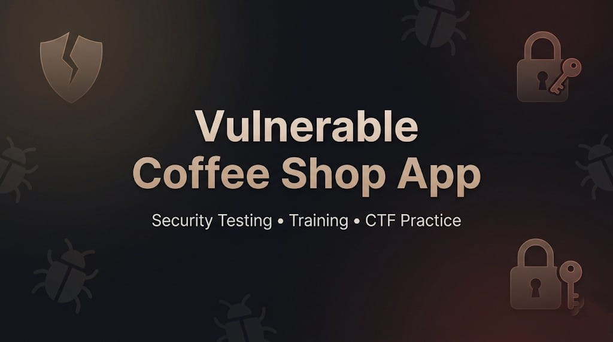
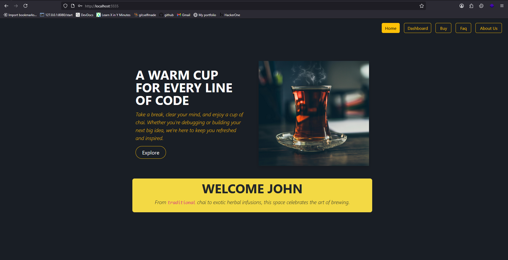
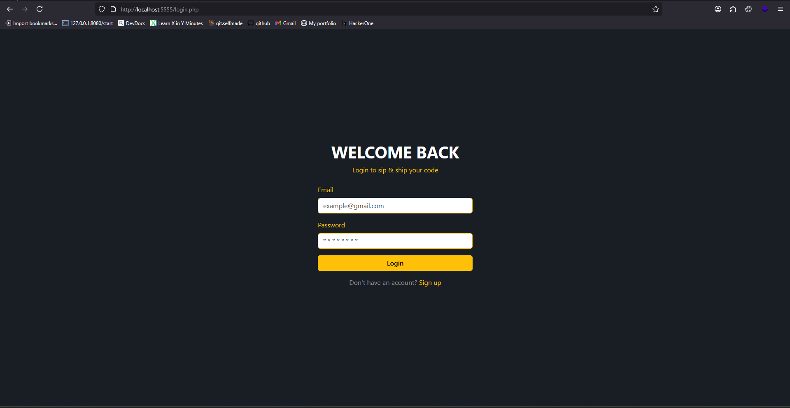
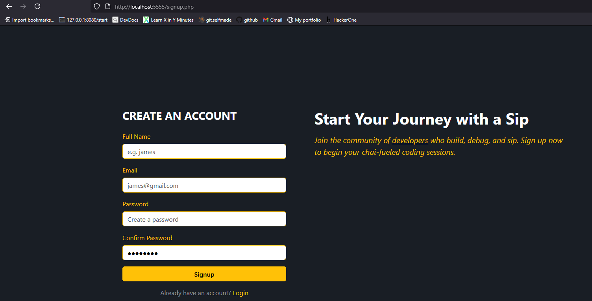
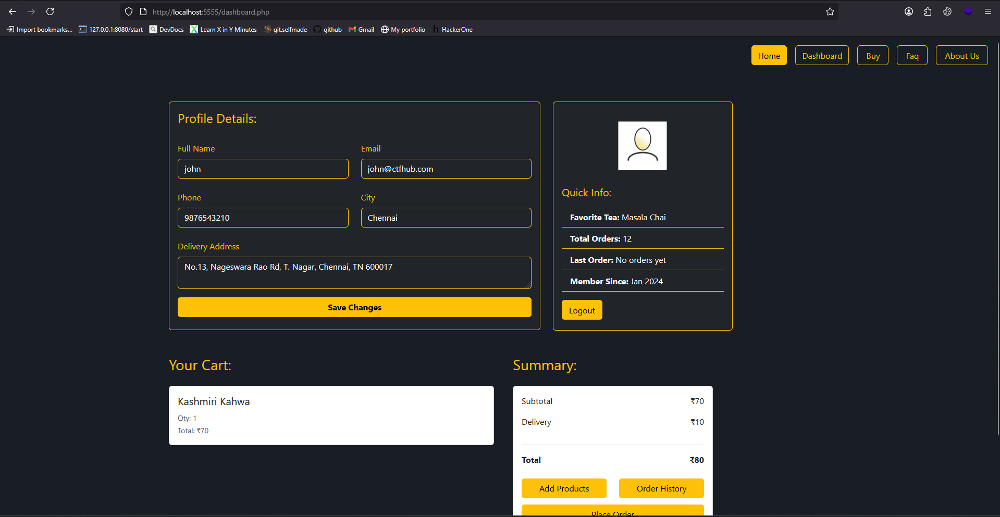
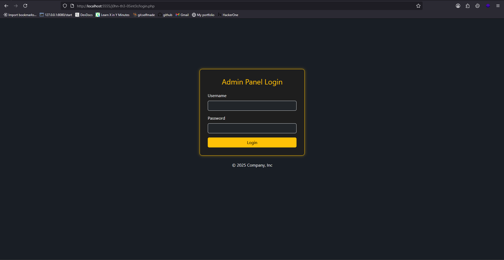
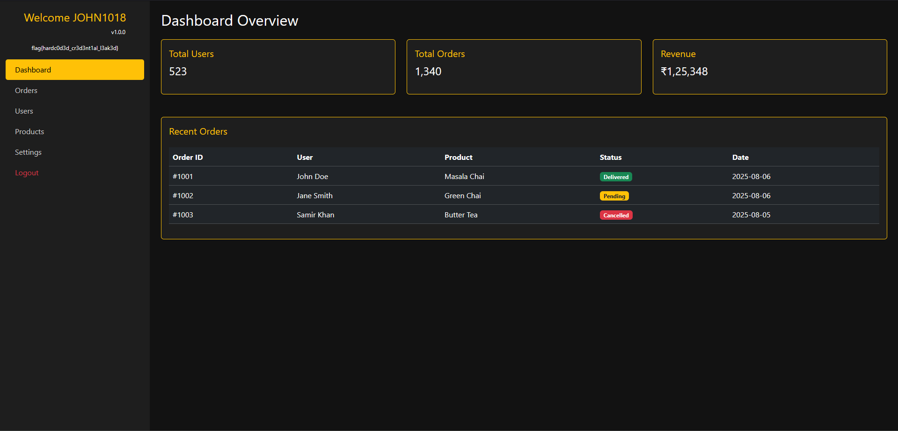
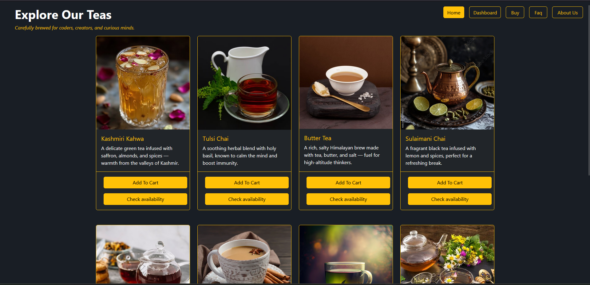
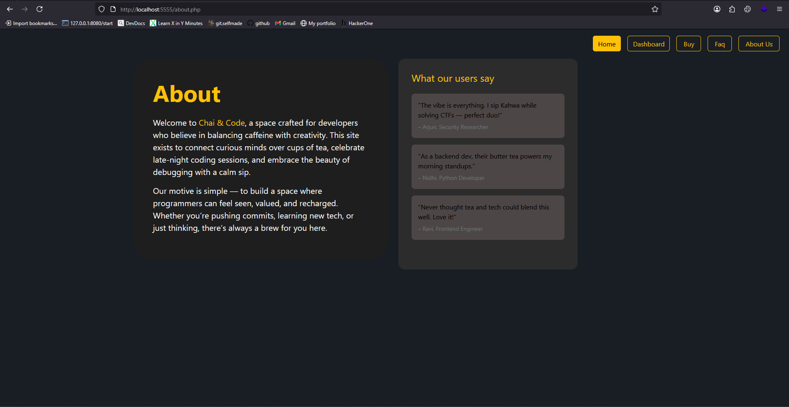

<p align="center">
  
</p>

<h1 align="center">CTF-HUB | Vulnerable Coffee Shop Web App ☕</h1>

<p align="center">
  A deliberately vulnerable multi-page e-commerce web application for learning web security, penetration testing, and CTF practice.
</p>

<p align="center">
  
  
  
  
</p>

---

## 📌 Overview

**CTF-HUB** is a vulnerable coffee/tea shop web application designed for:

- 🔐 Web security learning
- 🧪 Penetration testing practice
- 🏁 CTF-style challenges
- 🛠 Understanding real-world misconfigurations

The project is fully containerized using **Docker Compose**, with isolated services for:
- Web application
- Database layer

---

## 📸 Screenshots

<p align="center">
  
  
  
  
  
  
  
  
</p>

---

## ✨ Features

### 👤 Authentication
- Login / Signup / Logout
- Session-based user handling
- Profile update support

### 🛒 E-Commerce System
- Product listing
- Add to cart
- Order placement
- Order history tracking

### 🧑‍💼 Admin Panel
- Admin login portal
- Admin dashboard

### 🏁 CTF System
- 4 hidden flags embedded in vulnerabilities
- Gamified exploitation flow

---

## 🚨 Vulnerabilities (Intentionally Introduced)

> ⚠️ This application is insecure by design. Do NOT deploy publicly.

- 🧩 IDOR (Insecure Direct Object Reference)
- 🔐 Admin credentials disclosure
- 💻 Command Injection
- 📁 Local File Inclusion (LFI)
- 🧪 SQL Injection (via missing validation & sanitization)

---

## ⚙️ Setup & Installation

### 📦 Prerequisites
- Docker
- Docker Compose

### 🚀 Run Project

```bash
# Clone repository
git clone https://github.com/pevinkumar10/CTF-HUB.git
cd CTF-HUB

# Start services
docker-compose up -d
````

### 🛑 Stop services

```bash
docker-compose down
```

### 🌐 Access Application

```
http://localhost:5555
```

---

## 📂 Project Structure

```
ctf-hub/
├── database/              # DB container setup
├── web/                  # Web application container
│   ├── config/
│   ├── flags/
│   ├── scripts/
│   ├── src/
│   │   ├── classes/
│   │   ├── css/
│   │   ├── img/
│   │   ├── js/
│   │   ├── libs/
│   │   ├── products/
│   │   ├── templates/
│   │   └── j0hn-th3-05int3r/   # Hidden admin panel
├── docker-compose.yaml
├── pentest/               # Pentest reports
├── WALKTHROUGH.md         # Challenge walkthrough
├── LICENSE
└── imgs/
```

---

## 🏴 Flags & Challenges

| Vulnerability         | Flag Location           |
| --------------------- | ----------------------- |
| IDOR                  | User ID `1010`          |
| Admin Credential Leak | OSINT sources           |
| Command Injection     | `dev-notes.txt`         |
| LFI                   | `ma1nta1nanc3_n0t3s.js` |

---

## ⚠️ Legal Disclaimer

This project is intended **strictly for educational purposes**.

* Do not deploy in production
* Do not expose to public networks
* Use only in controlled environments

The author assumes **no responsibility for misuse**.

---

## 📜 License

Licensed under the [MIT License](./LICENSE).

---

<p align="center">
  Made with ❤️ for cybersecurity learning & CTF practice
</p>
