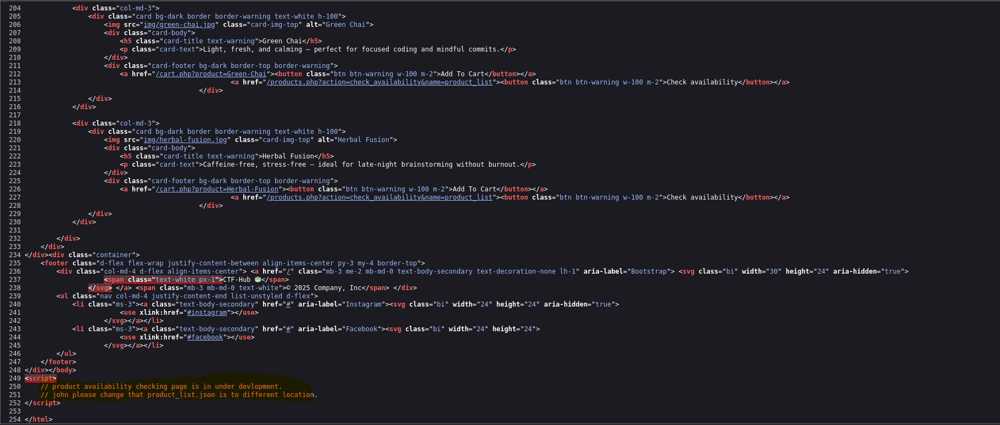
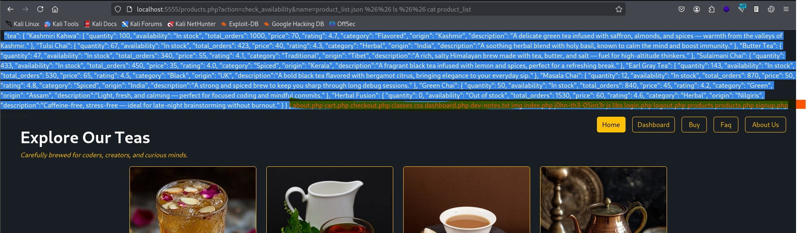
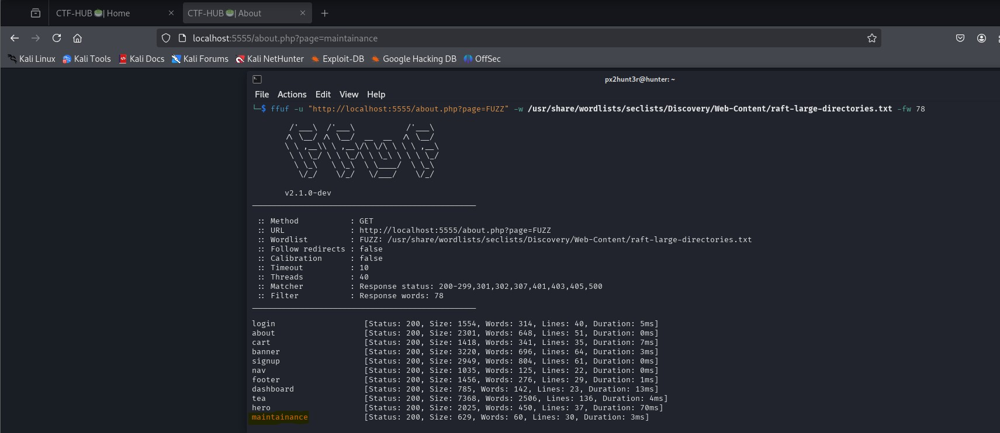
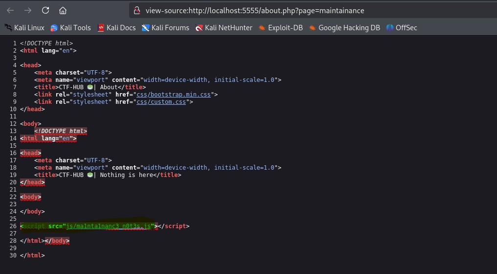
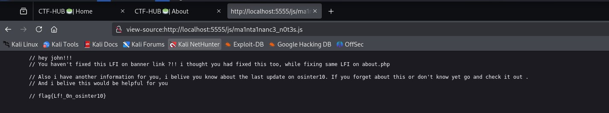
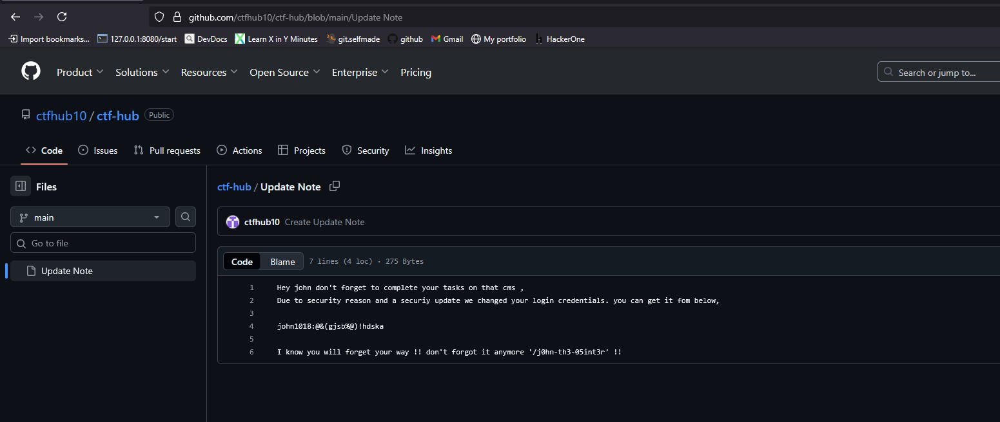
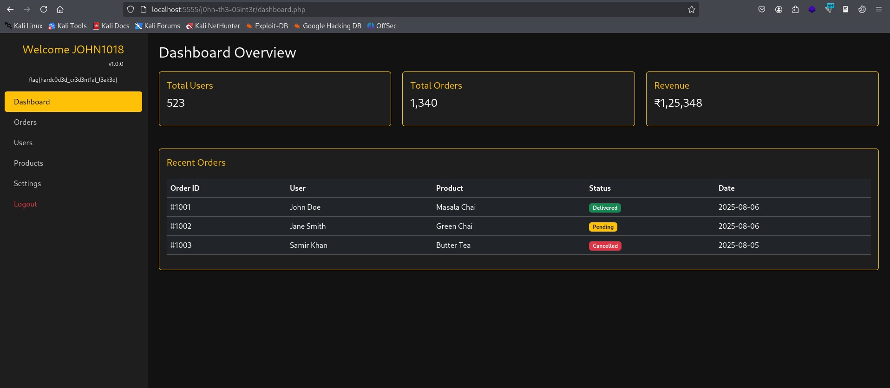

# CTF-HUB the coffee shop with known vulnerabilities to test and learn security misconfiguration.

## Introduction
Hey guys I am pevinkumar A and here we are going to see four common vulnerabilities which i developed to see from both programmer and attackers perspective.
In this CTF challenge, the goal was to identify and exploit multiple vulnerabilities in a Dockerized web application to obtain hidden flags. The target simulated a real-world vulnerable system, with intentionally placed flaws leading from one to another.

> Note: If you haven't configured the lab please checkout [README.md](./README.md) and setup the environment. 

### Lets GOOOO !!!

There may be more like sql injection due to lack of input validation and sanitization. Bute here we are going to see the which i developed and introduced.

The vulnerabilities discovered included:
- OS Command Injection
- Local File Inclusion (LFI) leading to OSINT discovery
- Credential Leak via exposed GitHub repository
- Insecure Direct Object Reference (IDOR) in order history


## Findings Overview
| Vulnerability                | Flag Location              |
| ---------------------------- | -------------------------- |
| Command Injection            | `dev-notes.txt`            |
| LFI                          | `ma1nta1nanc3_n0t3s.js`    |
| Admin Credentials Disclosure | `Osint`                    |
| IDOR                         | `On user id 1010`          |


Lets start with the first vulnerability OS Command injection.

## OS Command Injection

> Description:
The application provides a functionality at products.php where users can check the product availability by specifying that product name. The server executes a system command (cat) using this input. Although there is a basic blacklist filter intended to block dangerous characters (e.g., ;, (), |), the filtering can be bypassed by using alternate encoding and &&. This allows arbitrary system commands to be executed on the server.

> Steps to Reproduce:

- Step 1: Navigate to products page (You need to login first)

- Step 2: Click the 'Check availability' button of any product (From the source(Hint) it is in under development)

```js
    // product availability checking page is in under devlopment.
    // john please change that product_list.json is to different location.
```

- Step 3: Observe the url the paramenter `name` has the same name of the json file (from the output it shows it is json file) but in url it has only product_list so it could be a file read operation using cat with that json file to get all product details so we could bypass this using 'name=product_list.json %26%26 ls %26%26 cat product_list' because there is a filtering it blocking most of the malucious charector but not '&'. (As intented development ,this shows that a small misconfiguration led filter bypass)

- Step 4: Then you can see the first flag `dev-notes.txt` .To read that file, Submit the following payload `product_list.json %26%26 cat dev-notes.txt %26%26 cat product_list` and observe the command output containing the first flag.

> Screenshot:

<div align="center">
    <h4>Command Injection Hint:</h4>
    
    <h4>Command Injection:</h4>
    
</div>

> Flag:

```md
Finally you are here john !!

You really missed some malicious charectors on product availability checking feature.
Please try to add as much as you can or i would suggest you can use anyother way to get the list of products because executing commands on os is not necessary i think :) 

flag{c0mmand_1nj3ct10n_1s_5cary!!}
```

> Impact:

- Complete compromise of the underlying operating system with the privileges of the web server process.
- Possible data exfiltration, modification, and lateral movement.

> Mitigation:

- Never pass user input directly to system commands.
- Use safe APIs (e.g., PHP’s escapeshellarg() / Python’s subprocess.run with list arguments).
- Apply strict input validation with whitelisting (only digits and dots for IP addresses).
- Use a chroot jail or container isolation for untrusted processes.

Now move forward to LFI the next vulnerability.

## Local File Inclusion (LFI)

> Description:
The Local File Inclusion (LFI) is a vulnerability that occurs when a web application dynamically loads files based on user-supplied input without proper validation or sanitization. By manipulating the file path, an attacker can trick the application into loading sensitive files from the server’s filesystem. Here the `page=` on about.php (got from source code review) is vulnerable for LFI (Local file Inclusion) which allows an attacker to enumerate a certain directory and disclosed maintainace notes which has access key (In our case it is a flag).


> Steps to Reproduce:

- Step 1: Open the following url on the browser http://localhost:5555/about.php?page=about

- Step 2: Change the `page` parameter into anyother and see the response.

- Step 3: Run the following command to enumerate the directory **(In our case i checked wether the file is there in template dir or not so it can only access files inside /template directory.)**

```bash
ffuf -u "http://localhost:5555/about.php?page=FUZZ" -w /usr/share/wordlists/seclists/Discovery/Web-Content/raft-large-directories.txt -fw 78 
```
- Step 4: Observe the reponse from the ffuf tool (see below screenshot).

- Step 5: Try to access maintainance page by http://localhost:5555/about.php?page=maintainance (It looks innocent at first,but check `ma1nta1nanc3_n0t3s.js`. IT propose that the exposed file may have sensitive data like access keys,hardcoded credentials,etc)

> Screenshot:

<div align="center">
    <h4>LFI File Enuemration:</h4>
    
    <h4>LFI File Access:</h4>
    
    <h4>LFI Flag Access:</h4>
    
</div>

> Flag:

```js
    // hey john!!!
    // You haven't fixed this LFI on banner link ?!! i thought you had fixed this too, while fixing same LFI on about.php

    // Also i have another information for you, i belive you know about the last update on ctfhub10. If you forget about this or don't know yet go and check it out .
    // And i belive this would be helpful for you 

    // flag{Lf!_0n_osinter10}
```

> Impact:

- Sensitive Information Disclosure – An attacker can directly access files such as maintainance.php containing hardcoded credentials, API keys, or internal access tokens (in this case, the flag).
- Reconnaissance for Further Attacks – Reading system files or application code can reveal internal structure, logic, and other exploitable vulnerabilities.
- Privilege Escalation – If sensitive data like admin credentials are found, attackers could gain higher-level access to the application.
- Chain Exploitation – In combination with other vulnerabilities (e.g., file upload), this LFI could lead to Remote Code Execution (RCE).

> Mitigation:

- Strict Input Validation & Whitelisting (Only allow predefined filenames (e.g., about, contact, terms) and reject all other values).
- Remove Sensitive Files from Web-Accessible Directories.

Now move on to an intresting and very easy but high - critical Seviority vulnerability (depends on what we got).

## Hardcoded Credentials Exposed On Public Directory

> Description:
This vulnerability occurs when sensitive login credentials (such as usernames, passwords, API keys) are stored directly in the application’s source code, which is then accessible to attackers for example, through a publicly accessible repository or leaked code package. Here the vulnerability is occured due to the exposure of admin credentials on public repo ctfhub10 (repo name we got from LFI)

> Steps to Reproduce:

- Step 1: Open the github.com and search `user:ctfhub10` and it opens a git profile and it has ctf-hub repo with Update Note. which contains hardcoded credentials. (See screenshot below) 

- Step 2: Open the directory `/j0hn-th3-05int3r` and login with that exposed credentials.

- Step 3: Observe the screen ,it logged as admin. (see screenshot below) 

> Screenshot:

<div align="center">
    <h4>Credential Leak:</h4>
    
    <h4>Admin Dashboard:</h4>
    
</div>

> Flag:

```md
Hey john don't forget to complete your tasks on that cms ,
Due to security reason and a securiy update we changed your login credentials. you can get it fom below,

john1018:@&(gjsb%@)!hdska

I know you will forget your way !! don't forgot it anymore '/j0hn-th3-05int3r' !!
```

> Impact:

- Direct compromise of privileged accounts.
- Full administrative control of the application.
- Potential data theft, modification, or further exploitation (e.g., uploading malicious files, adding backdoors).

> Mitigation:

- Never store credentials in code — use environment variables or secure secrets management.

- Review commits for sensitive data before pushing to any remote repository.

- Rotate and invalidate exposed credentials immediately.

Now you can understand you shouldn't hardcode the credentials. (But this lab does have hardcoded credentials 👀)
Let's jump into our final vulnerability **IDOR**

## IDOR in Order History checking functionality

> Description:
An IDOR(Insecure Direct Object Reference) vulnerability occurs when an application exposes a reference to an internal object (like a user ID, order number, file path) without properly verifying whether the requester is authorized to access it. In this case, the web application’s order history feature uses a POST request with an id parameter to retrieve details of a specific order. The server does not validate that the order belongs to the logged-in user, allowing an attacker to manipulate the id and access another user’s order data. 

> Steps to Reproduce:

Step 1: Open the following url on browser http://localhost:5555/dashboard.php (Note: Need to login first)

Step 2: Configure burp proxy to capture the following request which has PII like phone number,delivery address,etc.

> Request:
```
POST /dashboard.php HTTP/1.1
Host: localhost:5555
Content-Length: 36
Cache-Control: max-age=0
sec-ch-ua: "Chromium";v="133", "Not(A:Brand";v="99"
sec-ch-ua-mobile: ?0
sec-ch-ua-platform: "Linux"
Accept-Language: en-US,en;q=0.9
Origin: http://localhost:5555
Content-Type: application/x-www-form-urlencoded
Upgrade-Insecure-Requests: 1
User-Agent: Mozilla/5.0 (X11; Linux x86_64) AppleWebKit/537.36 (KHTML, like Gecko) Chrome/133.0.0.0 Safari/537.36
Accept: text/html,application/xhtml+xml,application/xml;q=0.9,image/avif,image/webp,image/apng,*/*;q=0.8,application/signed-exchange;v=b3;q=0.7
Sec-Fetch-Site: same-origin
Sec-Fetch-Mode: navigate
Sec-Fetch-User: ?1
Sec-Fetch-Dest: document
Referer: http://localhost:5555/dashboard.php
Accept-Encoding: gzip, deflate, br
Cookie: language=en; continueCode=g872mOLbrgjJwK7DQ9p834o2nmvd5btQGkqYRlExW6z1PeaBMNyXV5ZMWrXO; welcomebanner_status=dismiss; cookieconsent_status=dismiss; PHPSESSID=5616a07a69525e7bd00f5818b8637003
Connection: keep-alive


id=MTAwMQ%3D%3D&action=check_history
```

> Response:

```html
<!-- Order History -->
    <div class="col-md-10 pt-5 my-5">
        <div class="card bg-dark border border-warning text-white shadow-lg p-4 mx-4">
            <div class="mb-4 d-flex justify-content-between align-items-center">
                <h4 class="text-warning m-0">🧾 Order History</h4>
                    </div>
                        <div class="table-responsive">
                            <table class="table table-dark table-bordered border-warning align-middle text-white">
                                <thead class="text-warning">
                                    <tr>
                                        <th>#</th>
                                            <th>Product</th>
                                            <th>Qty</th>
                                            <th>Price</th>
                                            <th>Name</th>
                                            <th>Phone</th>
                                            <th>Address</th>
                                        </tr>
                                    </thead>
                                    <tbody>
                                            <tr>
                                                <td>1</td>
                                                <td>Masala Chai</td>
                                                <td>2</td>
                                                <td>₹50</td>
                                                <td>john</td>
                                                <td>9876543210</td>
                                                <td>No.13, Nageswara Rao Rd, T. Nagar, Chennai, TN 600017</td>
                                            </tr>
                                            <tr>
                                                <td>2</td>
                                                <td>Green Chai</td>
                                                <td>1</td>
                                                <td>₹45</td>
                                                <td>john</td>
                                                <td>9876543210</td>
                                                <td>No.13, Nageswara Rao Rd, T. Nagar, Chennai, TN 600017</td>
                                            </tr>
                                    </tbody>
                                </table>
                            </div>
                        </div>
                    </div>
                </div>
        </section>
    </div>
</div>
```

> Screenshot:

<div align="center">
    <h4>Command Injection Hint:</h4>
    
</div>

> FLag:

```md

f1ag{ID0R_1s_Scary_If_P11_Exp0s3d}

```
> Impact:

- Unauthorized access to other customers’ personal order history.
- Possible exposure of sensitive data such as names, addresses, payment details, and flags in a CTF context.

> Mitigation:

- Implement proper authorization checks at the server side to ensure the logged-in user owns the requested order.
- Use indirect references (e.g., UUID tokens mapped internally) instead of direct numeric IDs in client-facing requests.
- Perform strict server-side validation before returning sensitive data.

## Conclusion

Through a chain of vulnerabilities starting from OS Command Injection and ending with IDOR, all flags were captured. The challenge demonstrates the importance of secure coding practices and proper input validation.

> Note: As i said before if we tested for sqli it must be there due to the intention to created a vulnerable environment so if you found any other sqli im really happy and let me know what is it how did you approch that. 

<p align="center">
  ❤️ Happy to learn and grow .🌱
</p>
